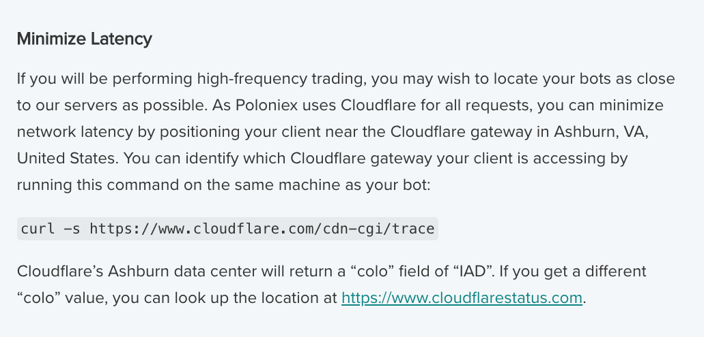
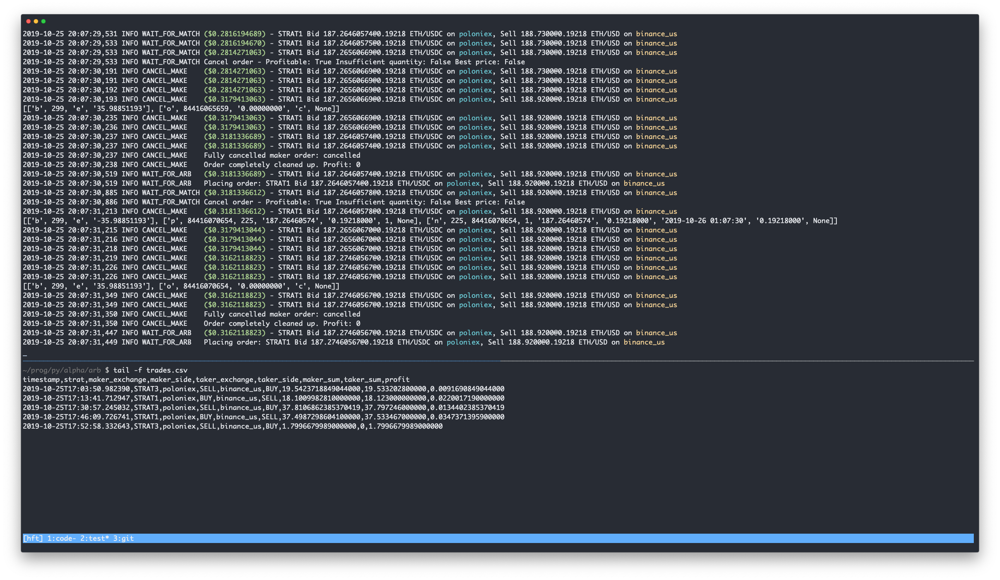

### Project Structure

```
algo/ - various trading bots that implement various strategies
    - arb.py & cross.py are essentially earlier renditions of mirror.py
    - mm.py & mm2.py are attempts at naive market makers
    - farb/ contains ledgerx forward arbitrage code
api/  - implementation of exchange apis (REST/WS)
    - common.py contains common objects that contain exchange events and other parsing tasks
    - ob.py implements a generic orderbook
    - wrappers.py is for parsing exchange events into the corresponding common.py object 
    - trade.py manages the creation of a combined event stream from supported exchanges
util/ - misc helper functions
```

### Strategies

#### Mirror strategy

See [mirror.py](https://github.com/capricorn/crypto/blob/master/algo/mirror.py)

This strategy was an attempt to work around taker fees in hopes of increasing
arbitrage opportunities. Using this method, an arbitrage opportunity was available
whenever the bid or ask price differed between two exchanges, less the maker and taker
fees on each exchange.

For example, if exchange A had a bid of 100, and exchange B had a bid of 102, then
the bot would attempt to get a maker order filled at 100 on A. If that order filled, the bot
would immediately sell the corresponding fill on exchange B, pocketing
a profit of 2 (assuming no fees).

This varies from traditional arbitrage when the orderbooks cross and the ask on one 
exchange dips below the bid on another.

This strategy was particularly useful when Binance US opened and Poloniex announced
its closure to US customers, as both had 0% maker fees at the time, and in the case
of Binance US, 0% taker fees as well.

The operation was divided into six different strategies, which corresponded to which
exchange would be the maker, and which the taker, and what side of the book. That
comes out to 4 strategies. Then, there were two traditional arbitrage strategies,
taker-taker, which differed only in which exchange we were buying from, and which we
were selling to.

##### Issues

- Problems with partial fills on one exchange that were too small to sell on
the corresponding exchange, and thus had to cross the spread and dump on the
initial exchange, taking the spread as a loss.

- Fills could occur, and immediately after the arb opportunity would disappear
on the corresponding exchange, resulting in a loss.

- Fees make it essentially impossible to compete, since many automated traders
have moved enough volume to have much smaller fees.

- Typically required holding the traded currency, since shorts were prohibitively
expensive, given their fees. Results in risk of negative price movements that
wipe out any arb profits. Also means that holdings cannot be leveraged to capture
larger arb opportunities.

- Maker order placement is naive as it gets, just tries to peg the order to the top of the
best bid or ask at the time, if it still results in an arb profit.

The bot ran on an aws instance fairly close to both
Binance US and Poloniex at the time, US-East-1 if I recall correctly. Had
around 1ms ping. Here is what Poloniex recommended for server location at the time:



Here is a video of the mirror bot in action:

[](https://www.youtube.com/watch?v=O9g16dsZF30)

And here is an image of the bot including a trade log:



#### Synthetic forward strategy

See [farb.py](https://github.com/capricorn/crypto/blob/master/algo/farb/farb.py)

The goal of this strategy was to find and take arbitrage opportunities between
swaps and synthetic forwards.

The idea is that we could purchase a 1 day swap, and have .01 btc in our possession.
Then, we would turn around and sell that btc for a slightly higher price by selling
a forward.

Alternatively, we would purchase .01 btc via forward, and then sell the btc acquired
from that forward as a 1 day swap, for a small profit.

Forwards were not actually offered on the exchange, but could be constructed by
using call and put options. For example, to buy a btc by constructing a forward,
we could sell a put and buy a call, both at the same strike price.

However, the bot was not so simple as to just wait for a perfect opportunity to arise,
especially since volume is relatively low on LedgerX. Instead, it tried to find
opportunities that could occur if a single maker order was filled. For example,
attempting to get cheaper swaps or options by simply placing limit orders at the bid.
Given the large spread on most of the options, this opened up many more arbitrage
opportunities.

There was then the question of deciding which contracts to target for placing
limit orders. There are many different contracts, all with varying expirations
and strikes. Since I have a limited amount of USD to use, I wanted to avoid
placing limit orders on contracts that had a high chance of not filling for some
time.

The way I solved this was to utilize the 24 hour volume that LedgerX provides for every
contract. Each contract was weighted by its potential profit with this volume. A contract
with high profit but low volume would be weighted lower than say a contract with less
profit but greater volume, as presumably you could move a larger notional amount.

Once each contract was assigned its value, the available USD had to be divided between
the contracts. I approached this as a knapsack problem, since I had a finite amount
of contracts I could 'pick up', and wished to maximize my profit.

##### Issues

- LedgerX seemed to not recognize forwards and credit you with its implied value.
For example, possession of a forward would mean a guarantee of delivery of BTC at
the strike price. LedgerX should allow you to then sell that BTC, assuming you
also have sufficient USD equivalent to the strike.

- Since three transactions had to occur in order to complete the arbitrage,
there was a risk of one of the items being purchased by someone else midway through the arb.
This carried a large penalty, since oftentimes spreads are quite large between
options, and dumping the trade would result in significant losses.

- Deciding on a fair bid price (or ask) for contracts that had no offers. Presumably
something like Black-Scholes for a reasonable idea of its value?

- Never implemented support for removing or adding new contracts as they arrived. This
didn't happen that often, since expiration dates were typically at least a week apart,
but required support.

- Had to implement some of the trading API myself, as at the time LedgerX did not seem to 
have an 'official' API documented for retail traders. This included authentication,
as well as submitting trades via REST, and tracking updates over websockets.

- In the end, could never seem to capture a reasonable arbitrage opportunity,
and ultimately abandoned the project.

#### Project Status

At this point in time, both programs are defunct. The mirror strategy is still valid,
but ultimately will require lower fees, and a more sophisticated strategy for getting maker
orders filled and managing risk.

The LedgerX program was also abandoned, in part due to extremely low volume and
lack of a solid API for retail trading at the time.
